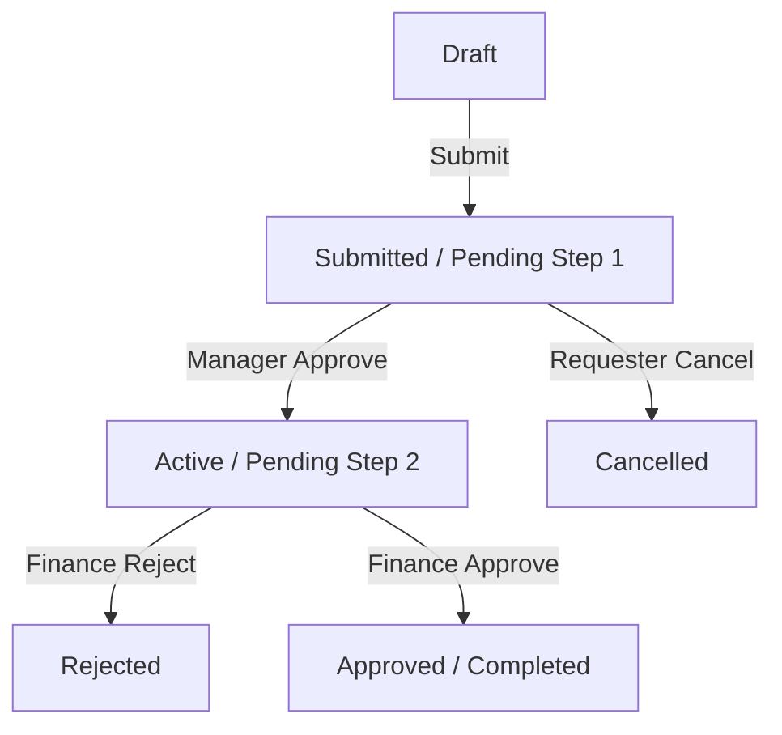

# TenantX System Architecture Deep-Dive

This document provides a technical deep-dive into the internals of the TenantX platform, detailing the design patterns, security enforcement mechanisms, and asynchronous pipelines that power the system.

---

## 🏗️ 1. Multi-Tenant Isolation Model

TenantX implements **Organization-Level Isolation Architecture**. This ensures that multiple enterprises can share the same hardware resources while maintaining strict logical separation of data.

### 1.1 Slug-Based Namespace Routing
Each organization is identified by a unique `tenant_slug`. The system uses this slug as a primary routing key:
*   **URL Context**: `/portal/{tenant_slug}/` routes the user to their specific organization dashboard.
*   **API Context**: Header `X-Tenant-Slug` or URL segments `/workflows/{tenant_slug}/` allow the backend to filter database queries at the entry point.

### 1.2 Database Scoping (Row-Level)
Instead of a dedicated database per tenant (which increases overhead), TenantX uses a **Tenant Discriminator Column** (`tenant_id`) on all cross-tenant models.
*   **Enforcement**: Use a global `TenantFilterMiddleware` to intercept queries and append `.filter(tenant=request.tenant)`.
*   **JWT Binding**: The verified `tenant_id` is extracted from the RS256 JWT, making it impossible for a user to query another organization's data by merely changing parameters.

---

## 🔐 2. Authentication & Identity Pipeline

Identity in TenantX is segregated into two logical boundaries: **SaaS Admin** (Platform Level) and **Tenant User** (Organization Level).

### 2.1 Token Isolation Pattern
To prevent session bleeding (where a platform admin session overwrites a tenant user session), the platform uses isolated cookie names:

| Platform | Token Cookie Name | Storage Type |
| :--- | :--- | :--- |
| **SaaS Admin** | `accessToken` | Memory/Cookie |
| **Tenant Portal** | `portal_access_token` | Memory/Cookie |

### 2.2 JWT Payload Structure (RS256)
All tokens are signed via RS256, allowing external services to verify the token's validity using the platform's **Public Key** without needing to access the database.

```json
{
  "tenant_id": "902d-...",      // The Organization ID
  "tenant_user_id": "8712-...", // Internal ID of the authenticated user
  "roles": ["manager"],          // List of assigned role names
  "permissions": ["workflow.approve", "workflow.reject"], // Granular action set
  "perm_version": 12,           // Incremental version for cache invalidation
  "exp": 1679000000             // Expiration timestamp
}
```

---

## 🔄 3. Workflow Engine State-Machine

The TenantX Workflow Engine handles complex multi-step approval processes based on hierarchical templates.

### 3.1 Transition Lifecycle
A workflow request moves through states controlled by role-based approval steps:



### 3.2 Granular Permissions (The "Power of 13")
Every workflow action is guarded by a specific permission string:
*   `workflow.create_request`
*   `workflow.view_details`
*   `workflow.approve`
*   `workflow.reject`
*   `workflow.reassign`
*   `workflow.archive`
*   ...and more.

---

## 🔍 4. Asynchronous Scanning Pipeline (SI Engine)

Security scans (OpenVAS and OWASP ZAP) are handled by a robust asynchronous pipeline to prevent UI blocking during 10-30 minute scan durations.

### 4.1 Process Flow
1.  **Web Request**: User triggers a scan via the dashboard.
2.  **Task Dispatch**: Django validates quotas and enqueues a `run_scanner_task` in **Redis**.
3.  **Worker Pick-up**: A **Celery Worker** picks up the task.
4.  **External Trigger**: The worker communicates with the OpenVAS/ZAP API server over a secure VPC link.
5.  **Polling & Completion**: The worker polls for completion and ingests the resulting XML/JSON reports into the database.
6.  **Notification**: An internal **SSE (Server-Sent Event)** or WebSocket signal updates the frontend dashboard in real-time.

---

## 💰 5. Billings & Razorpay Integration

TenantX uses **Razorpay** for subscription management.

*   **Webhook Resilience**: A dedicated endpoint `/billing/webhooks/razorpay/` handles `payment.captured` and `subscription.charged` events.
*   **Quota Enforcement**: Each tenant has a `scan_quota`. When the quota is reached, the backend blocks new `run_scanner_task` dispatches.

---

## 📊 6. API Route Mapping

| Feature Area | Frontend Service | Backend Route Context |
| :--- | :--- | :--- |
| **Platform Sign-in** | `authService.js` | `/auth/signin/` |
| **Portal Sign-in** | `tenantPortalApi.js` | `/tenant_auth/{slug}/signin/` |
| **Role Management** | `roleService.js` | `/rbac/roles/` |
| **Workflow Engine** | `workflowService.js` | `/workflows/{slug}/workflows/` |
| **Organization Config** | `orgService.js` | `/tenant_auth/organization/` |
| **Scanning Engine** | `scannerService.js` | `/security/scans/` (Trigger) |
| **Audit Logs** | `auditService.js` | `/audits/{slug}/audit/` |

---

## 🛠️ 7. Infrastructure & High Availability

Deployment is orchestrated via **Docker Swarm** on Ubuntu nodes.

*   **Secrets Management**: Docker Secrets handle DB credentials and RS256 Private Keys.
*   **Load Balancing**: Nginx acts as the entry point, performing SSL termination and routing based on Host headers or path prefixes.
*   **Scaling**: App workers and Celery nodes can be scaled independently (`docker service scale celery=5`).

---

> [!CAUTION]
> **RS256 Key Security**: The Private Key for JWT signing MUST NEVER be stored in the repository. Use Docker Secrets or a Vault in production.

> [!IMPORTANT]
> **Data Integrity**: Always use database transactions when updating workflow states to prevent race conditions during concurrent approval steps.
